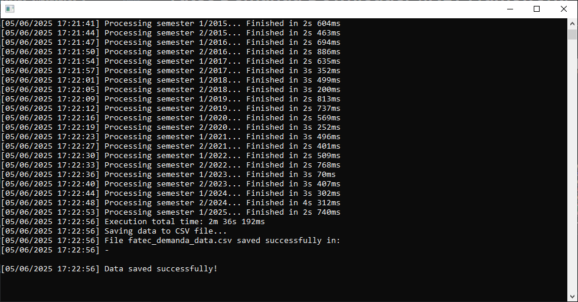

# Fatec Demanda Downloader (.NET Framework)

Este projeto automatiza o processo de download de dados de demanda de cursos das FATECs por meio de Web Scraping, utilizando **Selenium WebDriver** com o navegador **Chrome**.

Apenas a Fatec de Mauá está selecionada para o projeto de exportação.

Os dados coletados são exportados para um arquivo `.csv`.

<p align="center">
    <kbd>
        
    </kbd>
</p>

---

## 🛠 Tecnologias Utilizadas

- [.NET Framework](https://dotnet.microsoft.com/en-us/)
- [Selenium WebDriver](https://www.selenium.dev/)
- [Google Chrome Driver](https://sites.google.com/chromium.org/driver/)
- CSV Export (via `CsvExporterService`)
- MSTest (para testes unitários)

---

## 🚀 Como Executar

### 1. Pré-requisitos

- Visual Studio com suporte a .NET Framework
- [ChromeDriver](https://sites.google.com/chromium.org/driver/) compatível com a sua versão do Google Chrome
- Google Chrome instalado

### 2. Clonar o Repositório

```bash
git clone https://github.com/seu-usuario/FatecDemandaDownloaderNetFramework.git
cd FatecDemandaDownloaderNetFramework
```

### 3. Restaurar os Pacotes

Abra a solução no Visual Studio e aguarde a restauração automática de pacotes NuGet. Ou use o terminal:

```bash
nuget restore
```

### 4. Executar o Projeto

- Defina o projeto `FatecDemandaDownloaderNetFramework` como **projeto de inicialização**
- Pressione `F5` ou `Ctrl + F5` para executar

O programa irá:

- Acessar o site de demandas das FATECs
- Coletar os dados de demanda da Fatec Mauá para todos os semestres disponíveis
- Exportar os dados para o arquivo `fatec_demanda_data.csv`

---

## ✅ Como Executar os Testes

### 1. Acesse o diretório de testes

```bash
cd FatecDemandaDownloader.Tests
```

### 2. Execute os testes com MSTest

Se estiver utilizando Visual Studio, use o **Test Explorer**.  
Ou, pelo terminal:

```bash
dotnet test
```

Os testes cobrem funções auxiliares como:

- `CapitalizeText`
- `ParseFatecName`
- `NormalizeText`
- `FormatElapsedTime`

---

## 🗂 Estrutura do Projeto

```
FatecDemandaDownloaderNetFramework/
│
├── Pages/                          # Classes auxiliares para páginas da web
├── Services/                       # Exportadores e utilitários
├── Program.cs                      # Classe principal do projeto
├── export/fatec_demanda_data.csv   # Arquivo CSV gerado (após execução)
│
└── FatecDemandaDownloader.Tests/   # Projeto de testes MSTest
```

---

## 📌 Observações

- O navegador é executado em **modo headless**, sem abrir janelas visuais.
- Apenas dados da **Fatec Mauá** são processados por padrão.
- É necessário manter o ChromeDriver atualizado e compatível com a sua versão do Chrome.

---

## 📄 Licença

Este projeto está licenciado sob a **MIT License**. Veja o arquivo `LICENSE` para mais detalhes.

---

<h3 align="center">
    Feito com ☕ por <a href="https://github.com/Brendon3578">Brendon Gomes</a>
</h3>
